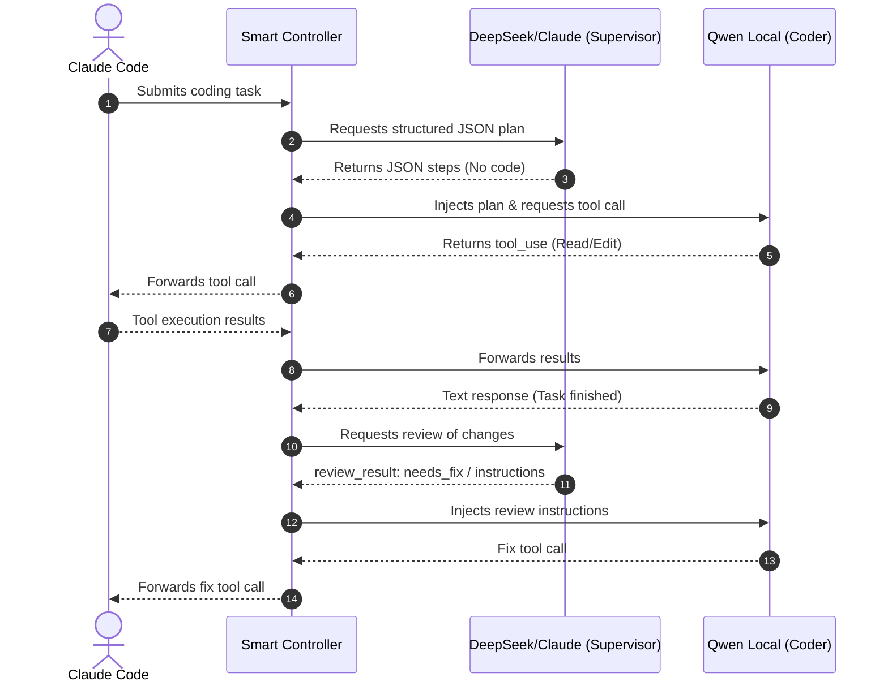

# Qwen Smart Controller Orchestrator (`qwen-smart-v2`)

The `qwen-smart-v2` mode pairs high-reasoning remote models (DeepSeek or Claude) with local Qwen coding workers. The remote models plan and review edits, while local models perform the filesystem modifications.

---

## Model Identifiers

- **ID**: `qwen-smart-v2`
- **Display Name**: `Qwen Smart Controller`
- **Aliases**: `qwen-smart-v2`, `smart-qwen`

---

## Execution Flow



---

## Structured Controller Outputs

To prevent high API costs, the supervisor (DeepSeek/Claude) is forbidden from emitting raw code blocks or replacement patches. 

### Allowed Output Shape (Planning)
```json
{
  "role": "planner",
  "task_summary": "Fix alignment on the header element",
  "target_files": ["src/components/Header.css"],
  "steps_for_qwen": [
    "Read the Header.css file",
    "Change display to flex and set align-items to center"
  ],
  "risk_notes": ["Ensure logo alignment is preserved"],
  "acceptance_checks": ["Run visual review on browser"]
}
```

### Allowed Output Shape (Reviewing)
```json
{
  "role": "reviewer",
  "review_result": "needs_fix",
  "instructions_for_qwen": ["Line 14 must be set to center instead of space-between"]
}
```

---

## Code Generation Violations

The supervisor must never return code blocks or replacement diffs.
If the supervisor response contains code strings or unified hunks:
1. The gateway rejects the output.
2. The gateway logs `controllerViolation = true`.
3. The gateway requests a rewrite from the supervisor, enforcing instruction-only responses.
