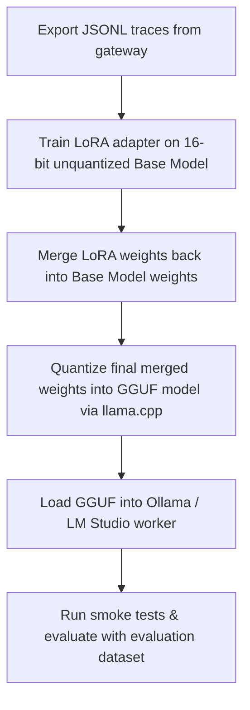

# Qwen Fine-Tuning Dataset Pipeline

This document explains the steps to build high-quality SFT (Supervised Fine-Tuning) and evaluation datasets using the traces collected by `qwen-agent`.

---

## Dataset Sizing Guidelines

Depending on the volume of traces captured under `/admin/qwen-agent/traces`, choose the corresponding optimization track:

1. **Prompt & Adapter Rules Tuning (100–300 Traces)**:
   - Identify recurring syntax issues, malformed JSON structures, or naming discrepancies.
   - Author custom matching patterns in the adapter rules repository (`POST /admin/qwen-agent/adapter/rules`) to resolve issues dynamically without model retraining.

2. **LoRA SFT Experimentation (500–1,000 Traces)**:
   - Compile a clean dataset of correct worker interactions using `sft_tool_calling` and `sft_tool_repair`.
   - Useful for teaching the model proper tool-selection structure under a guided context.

3. **Production Fine-Tuning (2,000+ Traces)**:
   - Captures rich task variations and tool execution histories. Highly recommended for producing native Claude Code behavior in local workers.

---

## SFT Fine-Tuning Best Practices

To train your local worker model successfully, adhere strictly to the following process:

> [!WARNING]
> **Do NOT fine-tune quantized weights (GGUF, AWQ, EXL2) directly**: Quantized weights do not possess sufficient precision to capture gradient changes cleanly. Retraining quantized files leads to model collapse or gibberish outputs.

### Fine-Tuning Execution Workflow

1. **Step 1: Unquantized Base Training**:
   - Select the unquantized base model (e.g. `Qwen/Qwen2.5-Coder-7B-Instruct`).
   - Run a Parameter-Efficient Fine-Tuning (PEFT) framework (such as Axolotl, LLaMA-Factory, or Unsloth) to train a LoRA adapter on the exported `JSONL` dataset.

2. **Step 2: Weight Merging**:
   - Merge the resulting LoRA adapter weights directly back into the 16-bit base model parameters.

3. **Step 3: GGUF Quantization**:
   - Run `llama.cpp`'s `quantize` script on the merged weight folder to compile a GGUF representation (e.g. `Q4_K_M` or `Q8_0`).

4. **Step 4: Verification and Evaluation**:
   - Start the local inference server with the new GGUF.
   - Run evaluation tests using `/admin/qwen-agent/datasets/build-eval` to confirm improved parsing correctness.
